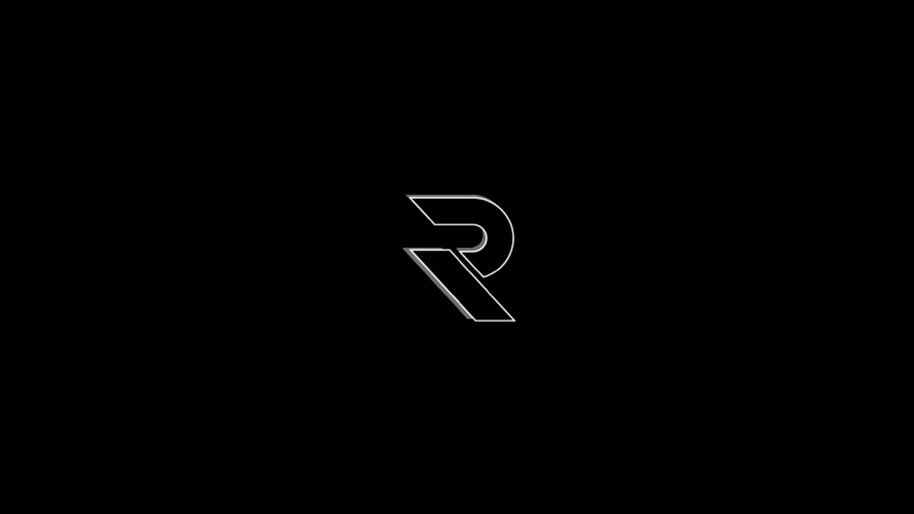

# RWKV Plugin for UE Projects

Welcome to the RWKV Plugin! This plugin is designed to make it easy to integrate complex Recurrent Neural Network (RNN) language models into your projects using HTTP communication. Our goal is to provide you with a simple and flexible way to harness the power of RNN models, whether you are developing games or creating interactive environments. 

## Features

- **Model Switching**: Easily switch between different models based on your configuration.
- **Precision Selection**: Choose the precision level that suits your needs.
- **Memory Layer Loading**: Adjust the memory layers to balance between inference speed and GPU load.
- **Privacy and Security**: The preset server is completely free and operates locally without needing an internet connection. Both the plugin and server do not collect user information, ensuring the privacy and security of user data.

## Basic Connection

### Interface Configuration and Usage

#### Switch Model
This module provides interfaces for model replacement, precision selection, and memory layer loading.

- **Model Selection**: Choose models based on your configuration. Models should be placed in `.\UE_object\RMKV_Server\models`.
- **Memory Layer Loading**: Increasing memory layers can effectively improve RWKV's inference speed but will significantly increase the GPU load. We recommend keeping the memory layer value within a reasonable range. In our experiments, a 4070TI GPU can handle up to 41 layers for a 3B model under CUDA fp16 precision, but when integrated with a digital human, it is around 31 layers.

#### ASK RMKV
This module provides interfaces for RWKV settings, OnSucceeded, and OnStream.

- **RWKVSetting**: This module is used to set parameters for RWKV and provides an input interface for your language and text input.
- **OnSucceeded**: This interface receives RWKV's return messages, which are sent all at once after RWKV completes processing.
- **OnStream**: Similar to OnSucceeded, this interface also receives RWKV's return messages but does so via streaming.

Both interfaces can be used simultaneously. For example, you can use streaming to break sentences, then verify the sentences' correctness and determine if sentence breaking should stop using the full sentence returned by OnSucceeded.

## System Requirements

- **GPU Memory**: A GPU with at least 12GB of memory is recommended for deploying this plugin, as GPU memory is essential for model inference. Alternatively, you can use a CPU to optimize UE projects and reduce costs.

## Installation and Setup

1. **Download and place models**: Place your chosen models in `.\UE_object\RMKV_Server\models`.
2. **Configure memory layers**: Adjust the memory layer settings based on your GPU's capacity.
3. **Set parameters**: Use the RWKVSetting module to configure the parameters for RWKV.
4. **Deploy and test**: Deploy the plugin in your UE project and test the interfaces to ensure they are working correctly.

## Usage

1. **Model Switching**: Use this interface to switch models as needed.
2. **Configure RWKV**: Set up the parameters using RWKVSetting.
3. **Receive Messages**: Use OnSucceeded and OnStream to receive messages from RWKV.
4. **Optimize Performance**: Adjust memory layers to balance performance and GPU load.

## Recommendations

- **GPU with 12GB+ memory**: Recommended for optimal performance.
- **Memory Layer Adjustment**: Keep within reasonable limits to avoid overloading the GPU.

## Important Directory Structure

Your project should maintain the following directory structure:

YourProject

|—Binaries

|—Config

|—.......（other files）

|—RMKV_Server

|—YourProject.uproject

After backing up, your project structure should look like this:

YourProject

|—.......（other files）

|—YourProject.exe

|—YourProject

|———|—Binaries

|———|—Content

|———|—RMKV_Server

|———|—Saved

To change or add a model, you need to add or delete it in the models folder under the RMKV_Server folder. This is a series of operations you need.

## Downloads

- Complete AsyncHttpRWKV example Unreal Engine project: [Download Link](https://drive.google.com/file/d/1MUSA-_o8SSY5rA9uiqadM0AceKA3AMDn/view?usp=sharing)
- Preset RWKV Server: [Download Link](https://drive.google.com/file/d/1n8aYMsUmurpJLyNa9cv_RNVJK6HeF8rx/view?usp=sharing)

By following this guide, you can efficiently integrate and use RNN language models in your projects. Enjoy the power of RWKV!

For more details and support, please refer to our documentation or contact our support team.

---

Thank you for choosing the RWKV Plugin for your UE projects!

